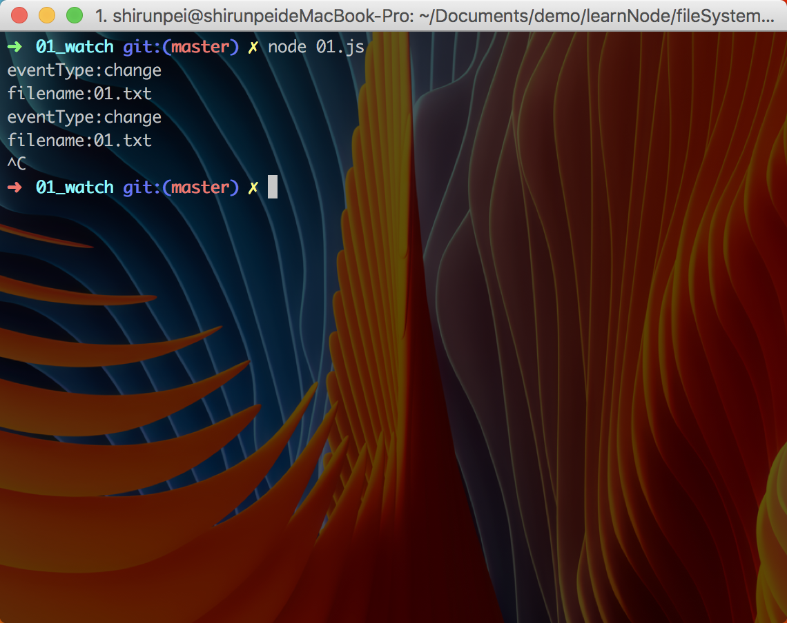
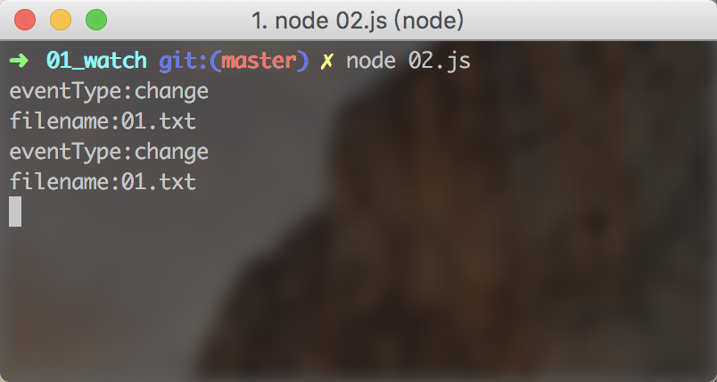

# fs.watch

`fs.watch(filename[, options][, listener])`

这个方法主要用来监听文件的变化，当文件发生变化的时候，就会触发 listener

&emsp;filename: 被监听的文件 `<string> | <Buffer> | <URL>`

&emsp;options: 如果 options 是字符串的话，则指定的是 encoding,否则应该以对象的形式传入 `<string> | <Object>`

&emsp;&emsp;persistent: `<boolean>` 指明如果文件正在被监视，进程是否应该继续运行。默认 = true

&emsp;&emsp;recursive: `<boolean>` 指明是否全部子目录应该被监视，或只是当前目录。默认 = false

&emsp;&emsp;encoding: `<string>` 指定用于传给监听器的文件名的字符编码。默认 = 'utf8'

&emsp;listener: `<Function>`

&emsp;&emsp;回调函数有两个参数 (eventType, filename), eventType 可以是 'rename' 或 'change'

>【注】`fs.watch` 依赖于底层操作系统提供的方法来通知 `File System`, 所有 `fs.watch` API 并不是 100% 跨平台一致的，且某些情况下不可用。

>【注】在 macOS 的系统上，修改目标文件只会触发一次`listener`，再次修改目标文件的时候并没有触发 `listener`

>【注】`listener` 的第二个参数 `filename` 仅在 Linux、macOS、Windows、以及 AIX 系统上支持。 即使在支持的平台中，filename 也不能保证提供。 因此，不要以为 filename 参数总是在回调中提供，如果它是空的，需要有一定的后备逻辑。

### demo
./01.js
```javascript
const fs = require('fs');

fs.watch('01.txt', (eventType, filename) => {
  console.log(`eventType:${eventType}`);
  if (filename) console.log(`filename:${filename}`);
})
```
使用 terminal 输入命令 `node 01.js` 运行 01.js, 然后修改 01.txt 文件的内容,可以看到 terminal 的输出如下：




./02.js
```javascript
const fs = require('fs');

var bf = new Buffer('./01.txt');

// 第一个参数传入一个 Buffer
fs.watch(bf, (eventType, filename) => {
  console.log(`eventType:${eventType}`);
  if (filename) console.log(`filename:${filename}`);
})

```

