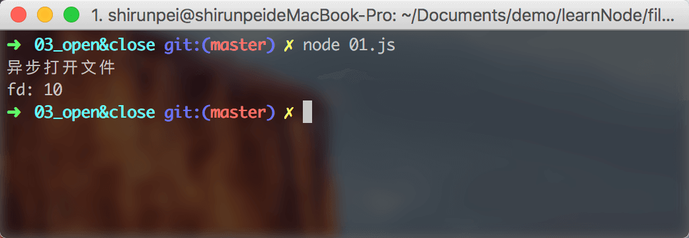
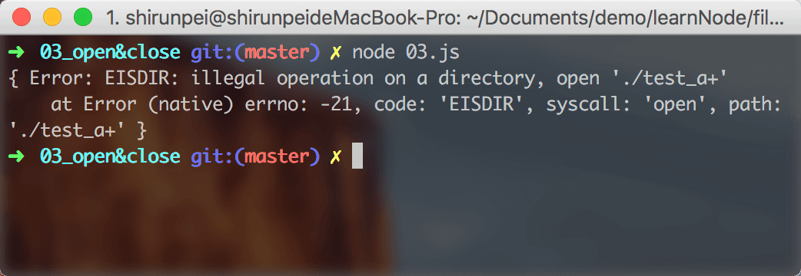

## fs.open

这个方法用于打开文件/文件夹，当我们打开文件成功之后，我们就可以获取文件描述符 fd。

<b>异步： `fs.open(path, flags[, mode], callback)`</b>

&emsp;path: 将要被打开的文件 `<string> | <Buffer> | <URL>`

&emsp;flags: 打开文件的方式 `<string> | <number>`

&emsp;&emsp;'r': 以读取模式打开文件。如果文件不存在则发生异常。

&emsp;&emsp;'r+': 以读写模式打开文件。如果文件不存在则发生异常。

&emsp;&emsp;'rs+': 以同步读写模式打开文件。命令操作系统绕过本地文件系统缓存。

&emsp;&emsp;'w': 以写入模式打开文件。文件会被创建（如果文件不存在）或截断（如果文件存在）。

&emsp;&emsp;'wx': 类似 'w'，但如果 path 存在，则失败。

&emsp;&emsp;'w+': 以读写模式打开文件。文件会被创建（如果文件不存在）或截断（如果文件存在）。

&emsp;&emsp;'wx+': 类似 'w+'，但如果 path 存在，则失败。

&emsp;&emsp;'a': 以追加模式打开文件。如果文件不存在，则会被创建。

&emsp;&emsp;'ax': 类似于 'a'，但如果 path 存在，则失败。

&emsp;&emsp;'a+': 以读取和追加模式打开文件。如果文件不存在，则会被创建。

&emsp;&emsp;'ax+': 类似于 'a+'，但如果 path 存在，则失败。

&emsp;mode: 设置文件模式（权限和 sticky 位），但只有当文件被创建时才有效。默认为 0666，可读写。`<integer>`

&emsp;callback: 该函数有两个参数 (err, fd) `<Function>`

<b>同步: `fs.openSync(path, flags[, mode])`</b>

这个方法与 fs.open 类似，返回文件描述符 fd

### demo
./01.js
```javascript
const fs = require('fs');

var path = './01.txt';

fs.open(path, 'r', (err, fd) => {
  if (err) {
    console.log(err);
  } else {
    console.log(`fd: ${fd}`);
  }
})

console.log('异步打开文件');
```



./02.js
```javascript
const fs = require('fs');

var path = './01.txt';

try {
  var fd = fs.openSync(path, 'r');
  if (fd) console.log(`fd: ${fd}`);
} catch (err) {
  console.log(err);
}

console.log('同步打开文件');
```


> 【注】fs.open() 某些标志的行为是与平台相关的。 因此，在 macOS 和 Linux 下用 'a+' 标志打开一个目录（见下面的例子），会返回一个错误。 与此相反，在 Windows 和 FreeBSD，则会返回一个文件描述符。

./03.js
```javascript
const fs = require('fs');

var path = './test_a+'; // dir

fs.open(path, 'a+', (err, fd) => {
  if (err) {
    console.log(err);
  } else {
    console.log(`fd: ${fd}`);
  }
})
```


## fs.close

这个方法用在 fs.open 操作完之后调用，用来关闭文件。同样也有 *同步* 和 *异步* 两个方法。

<b>异步: `fs.close(fd, callback)`**

&emsp;fd: fs.open 时获取的文件描述符 fd `<integer>`

&emsp;callback: 回调函数，只有一个可能发生异常的参数 `<Function>`

<b>同步: `fs.closeSync(fd)`</b>

&emsp;该方法返回 `undefined`

### demo
./04.js
```javascript
const fs = require('fs');

var path = './01.txt';

fs.open(path, 'r', (err, fd) => {
  if (err) {
    console.log(err);
  } else {
    fs.close(fd, (err) => { // 回调嵌套会让代码难以阅读
      var tip = err ? err : `close success`;
      console.log(tip);
    })
  }
})
```


./05.js
```javascript
const fs = require('fs');

var path = './01.txt';

try {
  // 同步操作的代码更加简明易懂,但是会阻塞进程,所以在使用的时候需要选择适当的方法
  var fd = fs.openSync(path, 'r');
  fs.closeSync(fd);
  console.log(`close success`);
} catch (err) {
  console.log(err);
}
```


