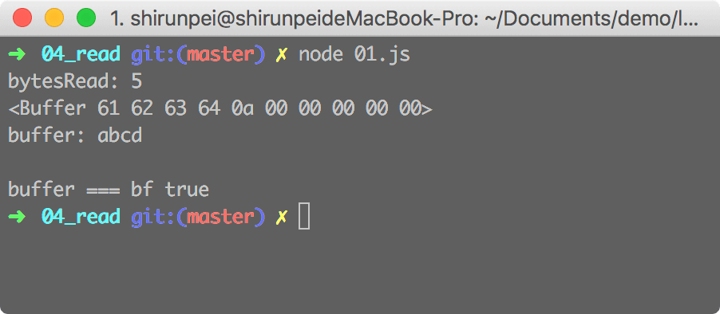

## fs.read

这个方法用于从指定的文件中读取数据

<b>异步：`fs.read(fd, buffer, offset, length, position, callback)`</b>

&emsp;fd: 从 fs.open 获取文件操作符 fd `<integer>`

&emsp;buffer: 读取的数据将存到此处 `<Buffer> | <Unit8Array>`

&emsp;offset: buffer 中写入的偏移量 `<integer>`

&emsp;length: 指定要从文件中读取的字节数 `<integer>`

&emsp;position: 指定从文件中开始读取的位置,如果为 null 则从文件开始的位置读取 `<integer>`

&emsp;callback: `<Function>`

&emsp;&emsp;该回调函数有三个参数 (err, bytesRead, buffer)

&emsp;&emsp;err: 异常参数

&emsp;&emsp;bytesRead: 读取到的数据的字节长度

&emsp;&emsp;buffer: 此 buffer 与 fs.read 方法的第二个参数的 buffer 为同一个

> 【注】length 不能超出 Buffer 的长度，否则会报错 RangeError: Length extends beyond buffer

### demo

./01.js
```javascript
const fs = require('fs');

var path = './01.txt'; // abcd\n

try{
  var fd = fs.openSync(path, 'r');
  var bf = new Buffer(10);
  fs.read(fd, bf, 0, 10, 0, (err, bytesRead, buffer) => {
    if (err) {
      console.log(err);
    } else {
      console.log(`bytesRead: ${bytesRead}`);
      console.log(buffer);
      console.log(`buffer: ${buffer}`);
      console.log(`buffer === bf ${buffer === bf}`);
    }
  })
} catch (err) {
  console.log(err);
}
```

> 01.txt 的数据为 'abcd' 最后还有一个换行的符号，同样也被读取出来了。 buffer 存储的为二进制的数据，控制台打印出来的为16进制的数据，与其他字符串拼接相当于调用了 buffer.toString

./02.js
```javascript
const fs = require('fs');

var path = './01.txt'; // abcd\n

try{
  var fd = fs.openSync(path, 'r');
  var bf = new Buffer(10);
  fs.read(fd, bf, 2, 8, 1, (err, bytesRead, buffer) => {
    if (err) {
      console.log(err);
    } else {
      console.log(`bytesRead: ${bytesRead}`);
      console.log(buffer);
      console.log(`buffer: ${buffer}`);
      console.log(`buffer === bf ${buffer === bf}`);
    }
  })
} catch (err) {
  console.log(err);
}
```


>offset 为 2，读取到的数据将写到 Buffer 索引为 2 的位置。

>length 的值不能超过 Buffer.length - offset，否则将会报错。

>position 为 1，将会从目标文件索引为 1 的位置开始读取数据， 01.txt 的内容为 'abcd\n'， 读取到的数据为 'bcd\n'。

## fs.readSync

该方法为 fs.read 的同步版本，返回值为 bytesRead。

<b>异步：`fs.readSync(fd, buffer, offset, length, position)`</b>

### demo

./03.js

```javascript
const fs = require('fs');

var path = './01.txt';

try {
  var fd = fs.openSync(path, 'r');
  var bf = new Buffer(10);
  var bytesRead = fs.readSync(fd, bf, 0, 10, 0);
  console.log(bytesRead);
  console.log(bf.toString());
} catch (err) {
  console.log(err);
}
```

