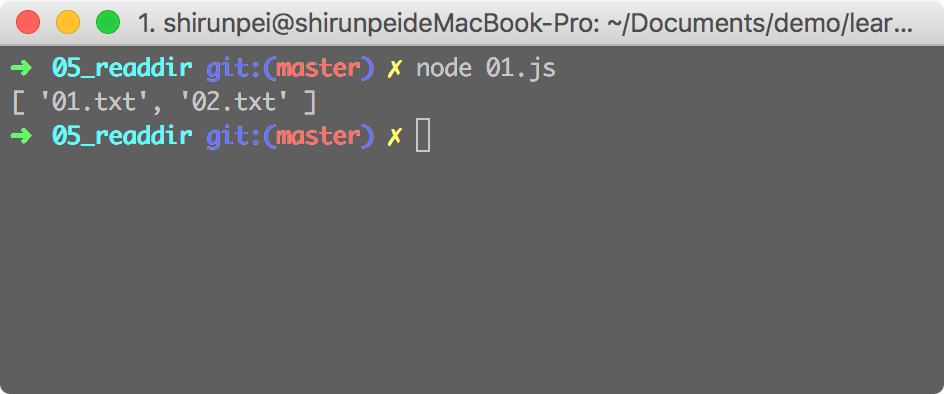
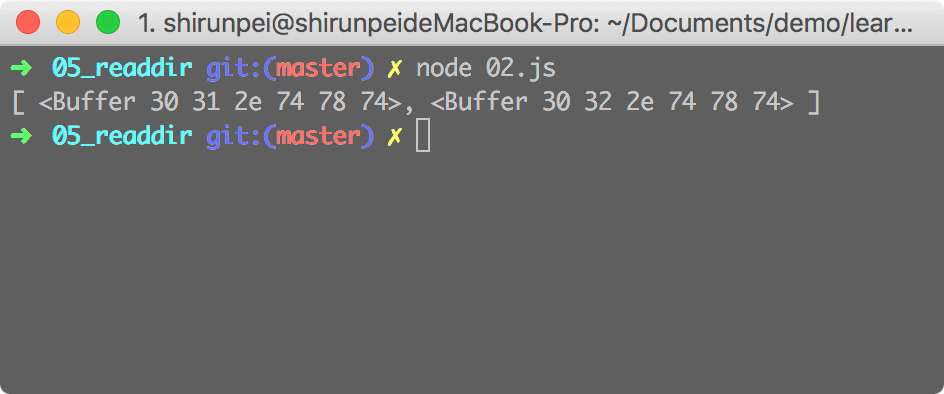
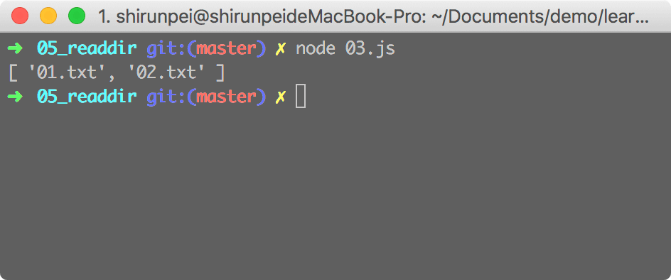

## fs.readdir

此方法用于读取一个目录的内容

<b>异步：`fs.read(path[, options], callback)`</b>

&emsp;path: 目录地址 `<string> | <Buffer> | <URL>`

&emsp;options: 可选参数，用来设置回调函数的参数，默认值为'utf8' `<string> | <Object>`

&emsp;&emsp;如果 options 为 Object，则我们可以设置其 encoding 为 'string' 或 'buffer'

&emsp;callback: 回调函数有两个参数 (err, files) files 为文件名组成的数组 `<Function>`

### demo

./01.js

```javascript
const fs = require('fs');

var path = './test';

fs.readdir(path, (err, files) => {
  if (err) {
    console.log(err);
  } else {
    console.log(files);
  }
})
```


./02.js
```javascript
const fs = require('fs');

var path = './test';

var options = {
  encoding: 'buffer'
};

// fs.readdir(path, 'buffer', (err, files) => { // ①
fs.readdir(path, options, (err, files) => { // ②
  if (err) {
    console.log(err);
  } else {
    console.log(files);
  }
})
```
a

> ./02.js 中 ①、② 都将 options 设置为 buffer,从打印的结果也可以看出 files 从原来的 string数组 变为 buffer 数组

## fs.readdirSync

该方法为 fs.readdir 的同步版本，其返回值为 fs.readdir 回调函数中的 files

`fs.readdirSync(path[, options])`

### demo
./03.js
```javascript
const fs = require('fs');

var path = './test';

try {
  var files = fs.readdirSync(path);
  console.log(files);
} catch (err) {
  console.log(err);
}
```

