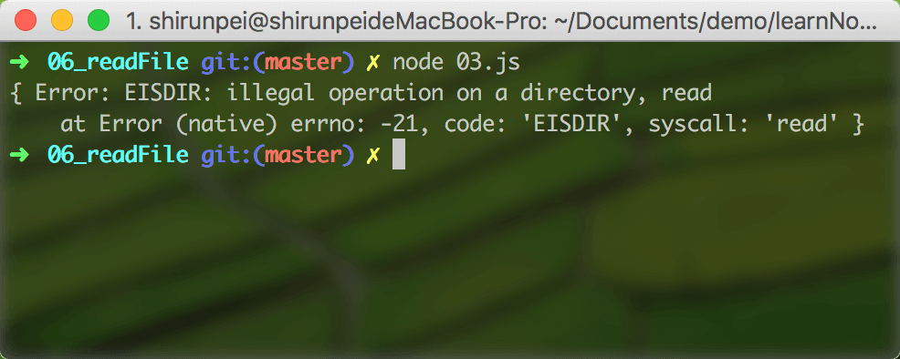

## fs.readFile

此方法用于读取一个文件的全部内容

<b>异步：`fs.readFile(path[, options], callback)`</b>

&emsp;path: 文件名或者是文件描述符 fd `<string> | <Buffer> | <URL> | <integer>`

&emsp;options: 如果是 string 则指定了字符编码，如果是 Object 则可以设置字符编码以及打开文件的方式`<string> | <Object>`

&emsp;&emsp;encoding: `<string> | <null>` 默认为 null

&emsp;&emsp;flag: `<string>` 默认为 'r'

&emsp;&emsp;callback: 回调函数有两个参数 (err, data) data 为文件的全部内容 `<Function>`

### demo

./01.js

```javascript
const fs = require('fs');

var path = './01.txt'; // abcd\n

fs.readFile(path, (err, data) => { // 未指定字符串编码，则会返回 buffer
  if (err) {
    console.log(err);
  } else {
    console.log(data); // <Buffer 61 62 63 64 0a>
  }
})
```

./02.js

```javascript
const fs = require('fs');

var path = './01.txt'; // abcd\n

fs.readFile(path, 'utf-8', (err, data) => {
  if (err) {
    console.log(err);
  } else {
    console.log(data); //  abcd\n
  }
})
```

./03.js

```javascript
const fs = require('fs');

var path = './test';

fs.readFile(path, (err, data) => {
  if (err) {
    console.log(err);
  } else {
    console.log(data);
  }
})
```
「 run in macOS 」


>【注】当 path 是一个目录时，在 macOS、Linux 与 Windows 上，会返回一个错误。 在 FreeBSD 上，会返回目录内容的表示。

## fs.readFileSync

该方法为 fs.readFile 的同步版本，其返回值为文件的全部内容

<b>同步：`fs.readFileSync(path[, options])`</b>

&emsp;path: `<string> | <Buffer> | <URL> | <integer>`

&emsp;options: `<string> | <Object>`

### demo

./04.js

```javascript
const fs = require('fs');

var path = './01.txt';

try {
  // ①
  // var fd = fs.openSync(path, 'r');
  // var data = fs.readFileSync(fd);

  // ②
  var data = fs.readFileSync(path);

  console.log(data); // <Buffer 61 62 63 64 0a>
} catch (e) {
  console.log(e);
}
```

>方法① 与 方法② 返回的结果一样
